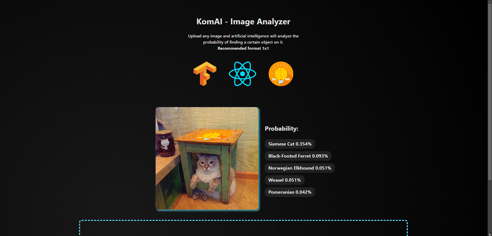
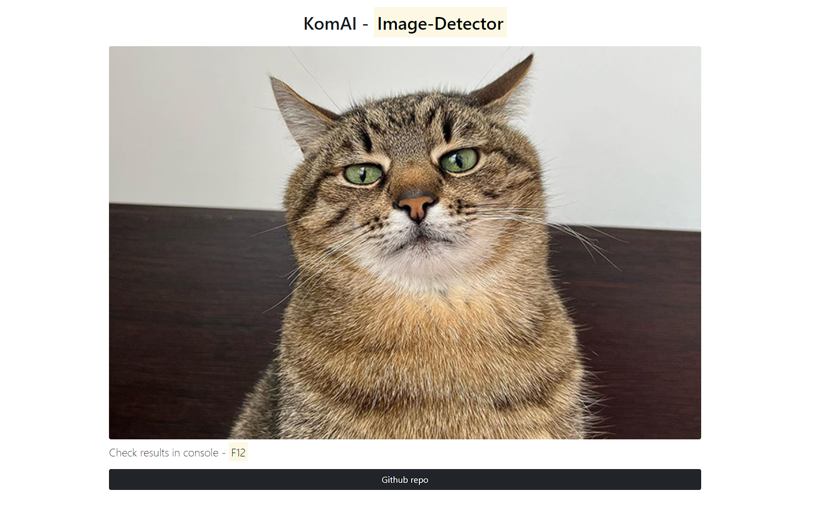

# KomAI-ImageDetector

<h1>Native verison</h1>
Just replace image path in index.html on your own picture and see results in <strike>console</strike> your browser
 
 

#### Youtube video - https://www.youtube.com/watch?v=YraIv4KKqEQ

## TODO
- [x] DnD
- [ ] AutoTranslate
- [ ] Fullscreen